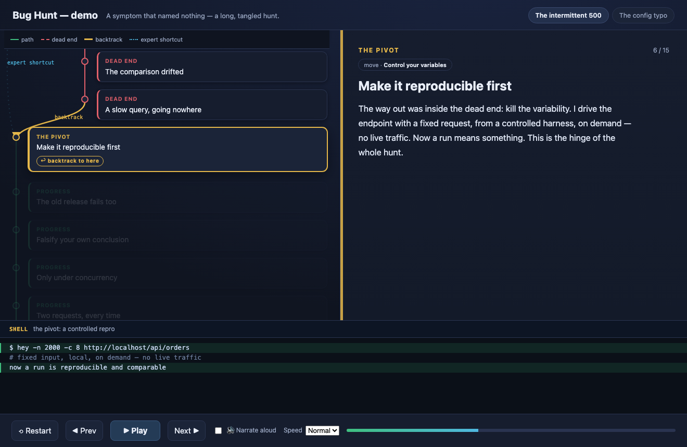

# Bug Hunt

**Turn a real debugging session into a narrated, animated flow graph — to *teach*
debugging.**

Teaching debugging is hard: the interesting part is the *reasoning* — the
hypotheses, the wrong turns, the moment you falsify your own conclusion — and
that part is invisible when you just read the final diff. Bug Hunt replays a
hunt as a graph you can step through: the path that reached the fix, the dead
ends that didn't, the backtrack, and the shortcut an expert would have taken.

## What it is

A single, dependency-free HTML page (`index.html`) that plays one or more **case
studies**. Each case is a bug hunt described as data (`cases.js`):

- **Left — the graph.** A main spine plus a dead-end **detour** (indented, red
  dashed), a **backtrack** arrow returning to the pivot, and a dotted **expert
  shortcut**. Colour-coded by phase; revealed step by step.
- **Middle — the narration.** What was believed and tested at each step, tagged
  with the debugging **move** it illustrates (see [`docs/moves.md`](docs/moves.md)).
- **Bottom — the evidence.** The actual logs / diff / stack trace / fix for that
  step, with the key lines highlighted.

Controls: **Play/Pause**, **Prev/Next**, **Restart**, speed, and **Narrate
aloud** (uses the browser's built-in speech, or pre-rendered audio if present).
Keyboard: space / ← / → / R. Deep-link a step with `#<case>-<step>` in the URL.

The point is **contrast**: put a tangled hunt next to a straight one and the
lesson — *what made the difference* — falls out of the shape.

## Run it

Just open `index.html` in a browser. No build, no server, no network. It loads
`cases.js` next to it; swap that file to show a different set of hunts.

## Make your own case

Author a case as data — see [`docs/authoring.md`](docs/authoring.md) for the
schema. In short, each step is `{chapter, kind, move, lane, title, narr}` plus a
matching entry in `code[]`, and `edges[]` wires the graph
(`seq | branch | backtrack | shortcut`).

- `scripts/extract-graph.py` turns a captured session log (JSON-lines of
  reasoning + actions) into a `cases.js` **skeleton** you then tag and prose up.
- `scripts/render-narration.sh` (macOS + [Piper](https://github.com/rhasspy/piper))
  renders natural speech per step and embeds it — optional; the browser voice
  works everywhere with zero setup.
- `scripts/build-standalone.sh` inlines a `cases.js` into `index.html` to produce
  one self-contained file you can email to someone.

## Why graphs, and why compare them

One graph *illustrates* a hunt; the insight is in the **diff between graphs**.
Tag every step with a move from a small shared vocabulary and you can compare
hunts structurally: which moves appear, in what order, where the dead ends
cluster, how a novice path differs from the expert one. The demo ships two cases
with deliberately opposite shapes — a tangle and a straight line — to show what
that comparison looks like.

## License

MIT — see [`LICENSE`](LICENSE).
